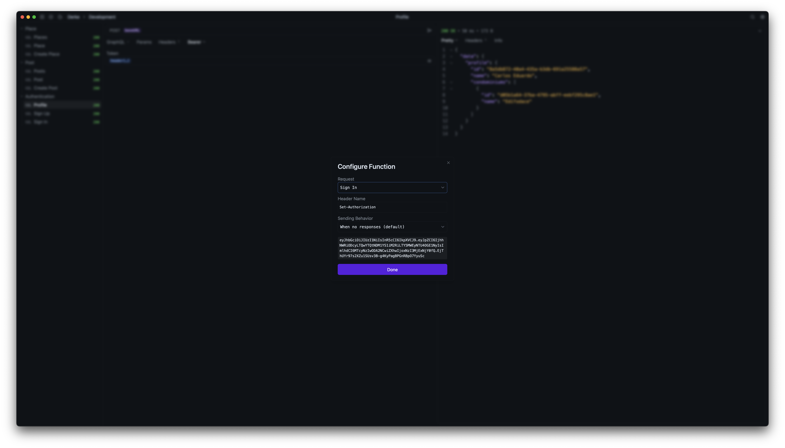

# Yaak Header Function Plugin

This plugin adds the ability to reference a header from another response in the same collection (similar to the `response` function plugin).

For further instructions on how to use this plugin, please refer to the [Yaak documentation](https://feedback.yaak.app/help/articles/6911763-quick-start)

## Screenshots

